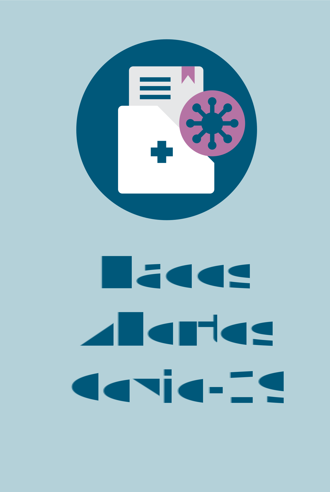

# **Dados disponíveis** 

 

          

              
          

          

              
    

  

 
  

      

              
    

   

    

          
    

 
  

          

              
          

          

              
          

  

 
  

    

              
   

   

    

          
    

 
  

          

              
          

    

              
  

  
      
 
  

    

        
    

  

    

      
    

